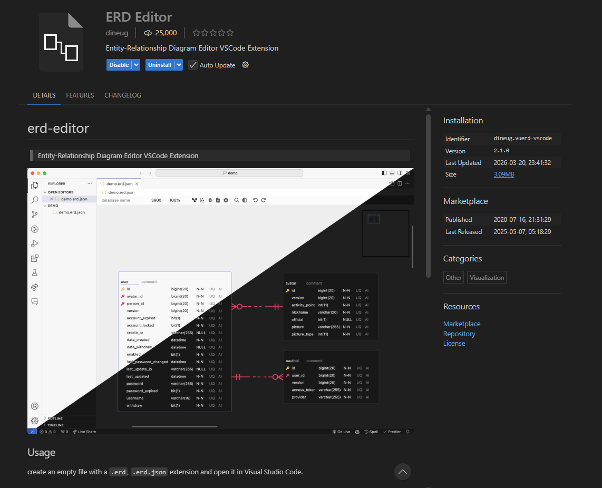
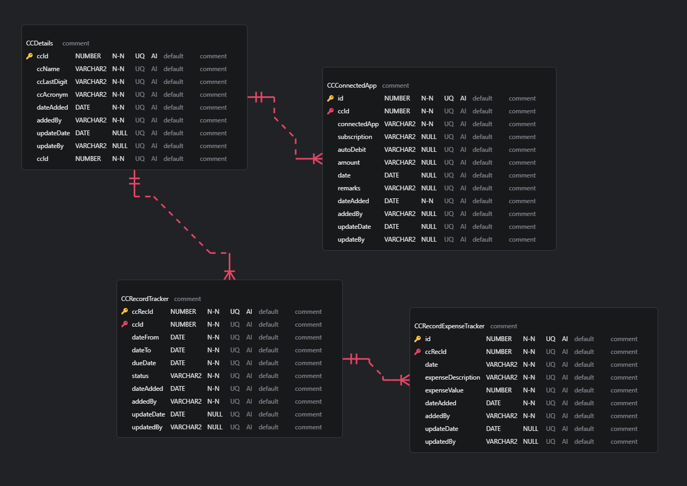
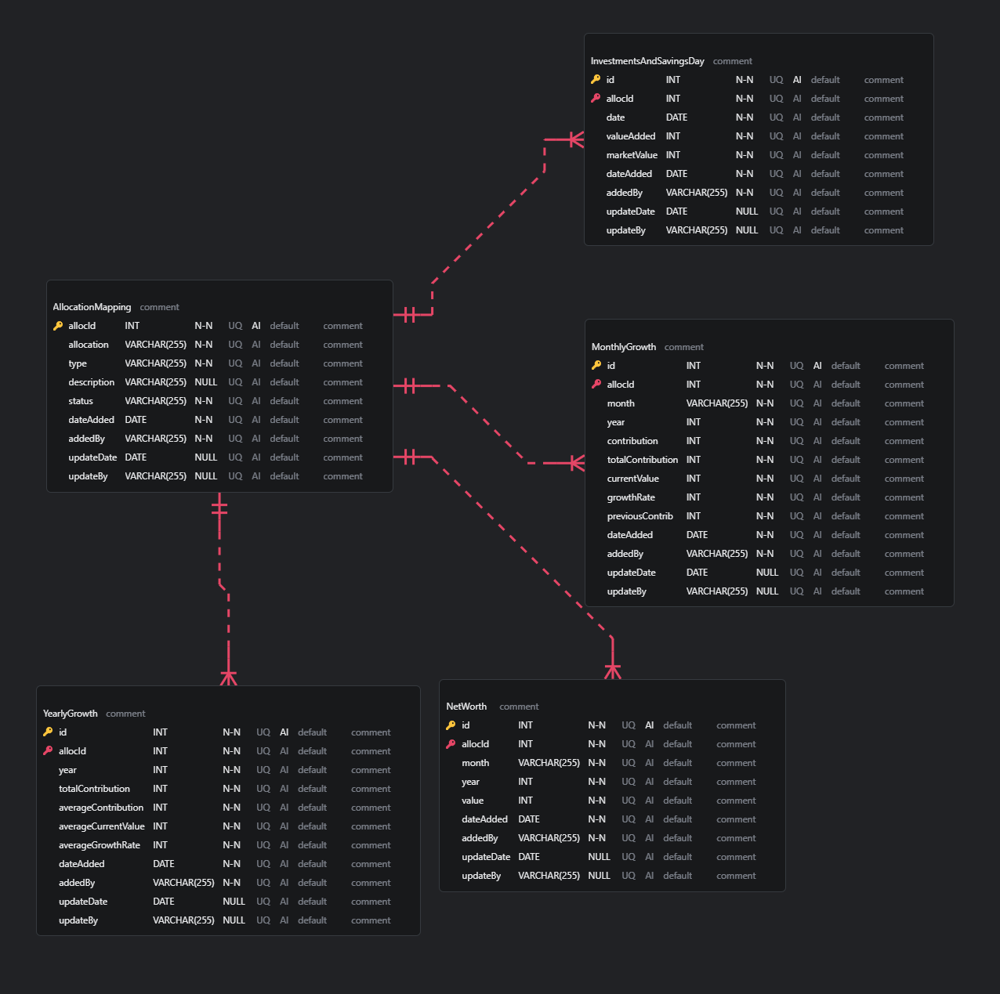
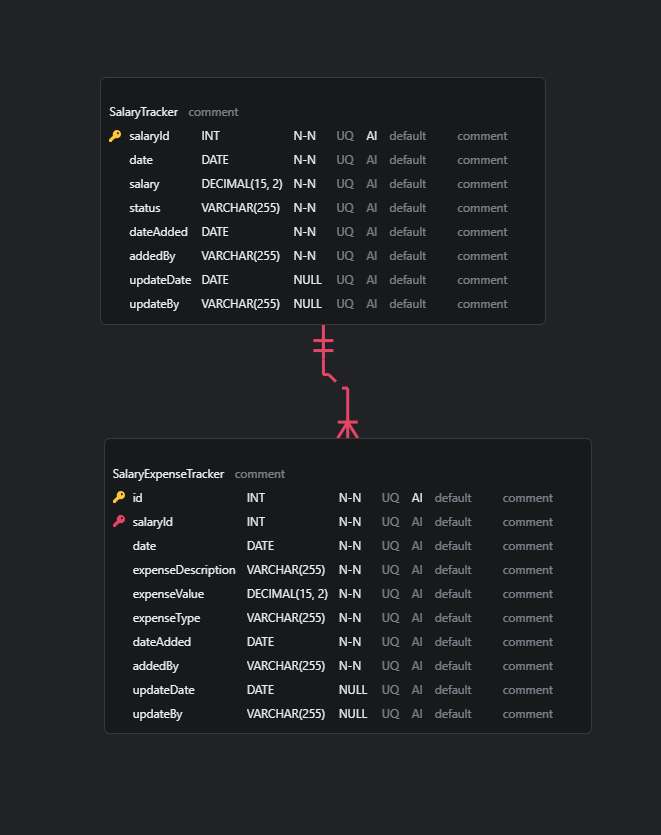
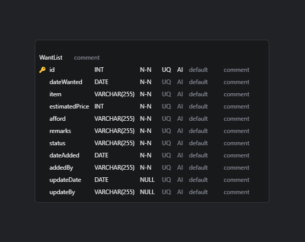
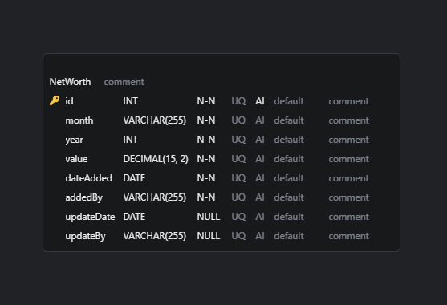
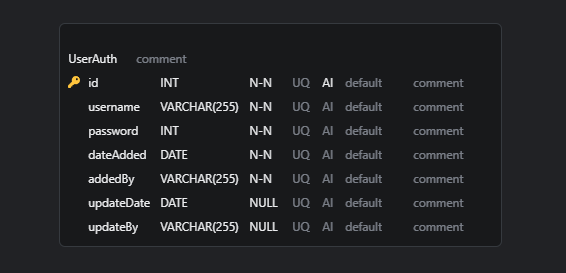
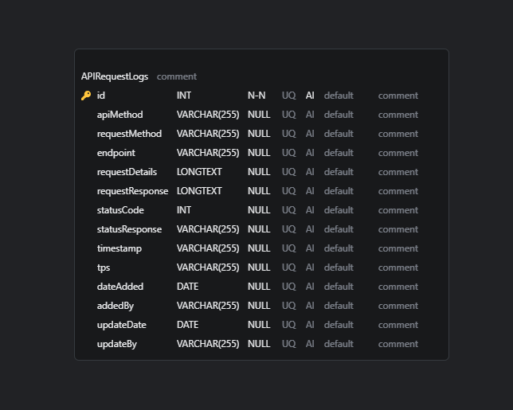

# Personal Finance Manager – Database

This repository contains the **database layer** for the Personal Finance Manager project.  
It provides the foundational structure for storing and managing financial data across the system.

✅ **Project Status:** Completed on **April 11, 2026**, but not limited for future enhancements, added features, and bug fixes.

## Overview

The database module is designed to:

- 🗄️ Store financial records such as income, expenses, budgets, and savings
- 🔍 Support queries for reporting and analytics
- 🔒 Ensure data integrity and security
- 🔄 Provide a consistent foundation for other modules (frontend, backend, analytics)

## Contents

- **Schemas** – Definitions of tables and relationships
- **Migrations** – Version-controlled updates to the database structure
- **Seed Data** – Sample datasets for testing and development
- **Configuration** – Environment and connection settings

## Database Information

- **MySQL Workbench 8.0**

## ERD Tool

- **Use ERD Editor extension on VS Code or Cursor IDE**

## ERD - Credit Card Related Tables

## ERD - Investment/Savings Related Tables

## ERD - Salary Related Tables

## ERD - Want List Related Tables

## ERD - Networth Table

## ERD - User Auth Related Tables

## ERD - API Request Logs Table

